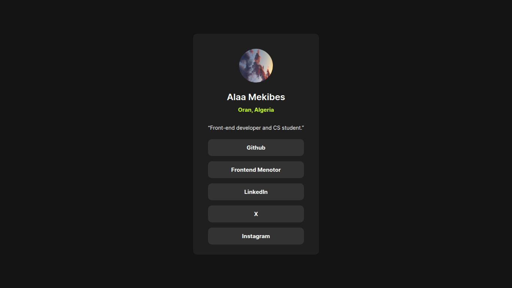

# Social Media Links Challenge

This is my first challenge from [frontendmentor](https://www.frontendmentor.io), the idea of this challenge is to build out this social links profile and get it looking as close to the design as possible.





## Licence Design

I did not design this template, I simply transformed the provided image file into a functional webpage using HTML & CSS, and this is [the design link](https://www.frontendmentor.io/challenges/social-links-profile-UG32l9m6dQ).

### Demo

You can view my work by clicking this link: https://alaa-mekibes.github.io/social-links-profile-frontend-mentor

### What I learned

There are two best ways to center elements inside `body` via CSS:

#### Flex Box

```css
body {
  display: flex;
  justify-content: center;
  align-items: center;
  min-height: 100vh;
}
```

#### Grid

```css
body {
  display: grid;
  place-items: center;
  min-height: 100vh;
}
```

- `min-height: 100vh;` is just to get full screen (full page). You can also use `height: 100vh` if the content is short.

I recommend focusing on learning either the grid or flexbox method. Mastering one of them will make you feel much more confident and comfortable moving forward.
